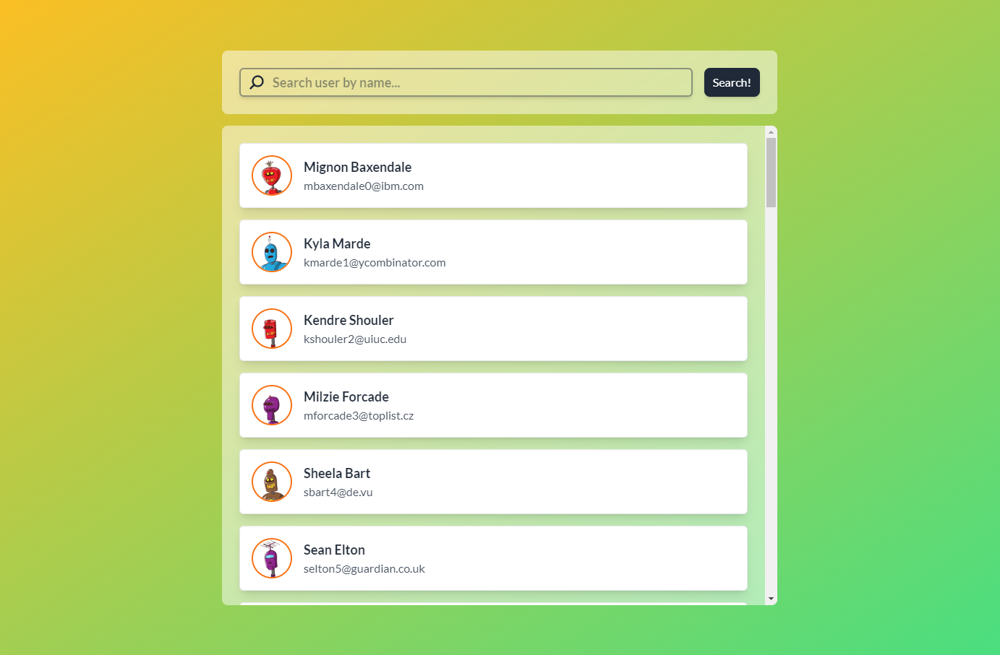

<div align="center">
  <h1>The Super Duper Über [REDACTED]</h1>
  
  
</div>
<br/>



## Installation

Install project dependencies

```bash
npm install
```

Run the app in development

```bash
npm run dev
```

Finally, open `http://localhost:5173` in your browser

Run unit tests

```bash
npm run test:unit
```
